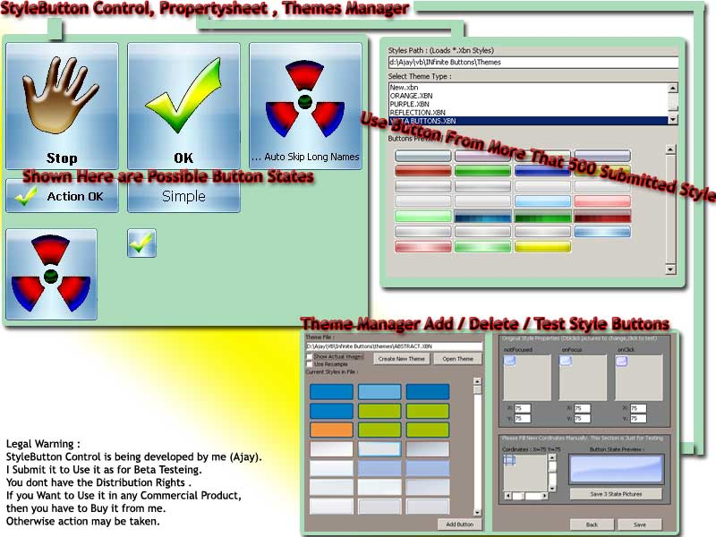



## AjayWarez \- StyleButton, 500\+ Designs , Image Support , \(Updated\)

### Description

(2/2/08) - STYLE BUTTON - a high quality skin button from ajay kumar having

more than 500 themes and a Beautifull themes manager

RECENT CHANGES :

* Version 1.2

############

Updated - Now All Common Functions (Standalone) Are In One Bas File.

Fixed - Major Bugs / Missing Code

Fixed - Theme Manager

Added - Theme Manager Now Supports Loading of Resampled Images to Correct Skin Problems

Fixed - Usercontrol 3 State Pictures Sections Problem

Updated - Propertysheet Now Shows Faster and Emulates Buttons Correctly

Added - Benchmarking Tool to Benchmark Buttons on Your System

Fixed - Usercontrol Button Picture Displaying Cordinates

&amp; Additional Bugs Fixed

* Version 1.1

###########

Updated - Full Functional Theme Manager . Add / Delete / Manage Styles in

Theme Files

Added - Font Support.

Added - Property Sheet Now Focus on Current Style.

Updated - Property Sheet Fast Loading.

Updated - UserControl Now Loads Very Fast

&amp; Additional Bugs Fixed

* Version 1.0

############

PropertySheet Fixes - Selection of the used theme , Speed up Loading , Multiple

Buttons Skin Selection Supported , &amp; Bug Fixed

Usercontrol Fixes - Speeded Up , Added Normal Button Style , Loading Time

Optimized , Memory Leak Fixed &amp; Known Bugs Fixed

HOW TO USE :

Add a Usercontrol and propertysheet to the current project, add usercontrol to the

form , right click and select properties. if there's no theme file listed then set the

path to themes folder (defaultly its set to use it from current directory\themes folder.

but you can change it). you can then select the theme file and select its style and

click ok . you can add a image to the button by selecting the usercontrol and click

buttonstyle on the right side properties of usercontrol. if you want to algin the image

to center, just resize the control and increase its height. to set the image in left side ,

just resize the control and decrease its height .

ABOUT STYLE BUTTON :

This is a usercontrol of sytle button and it is highly skinnable . it uses a property

sheet to set the theme . the theme files are templates that are used to set the button

styles once . when you use the usercontrol and compile It , it does not needs theme

files (themes are just required at the selection time) . more than 500 button styles are

included in this release.

TO CREATE THEMES :

create 3 state images using photoshop or any image editing software . open theme

manager. select the 3 images, set the x,y propertys by selecting the preview. push

Save.
 
### More Info
 

             |
---                |---
**Submitted On**   |2008-02-03 10:31:48
**By**             |[ajaybnl](https://github.com/Planet-Source-Code/PSCIndex/blob/master/ByAuthor/ajaybnl.md)
**Level**          |Advanced
**User Rating**    |4.6 (64 globes from 14 users)
**Compatibility**  |VB 6\.0
**Category**       |[Custom Controls/ Forms/  Menus](https://github.com/Planet-Source-Code/PSCIndex/blob/master/ByCategory/custom-controls-forms-menus__1-4.md)
**World**          |[Visual Basic](https://github.com/Planet-Source-Code/PSCIndex/blob/master/ByWorld/visual-basic.md)
**Archive File**   |[AjayWarez\_210035242008\.zip](https://github.com/Planet-Source-Code/ajaybnl-ajaywarez-stylebutton-500-designs-image-support-updated__1-66103/archive/master.zip)

